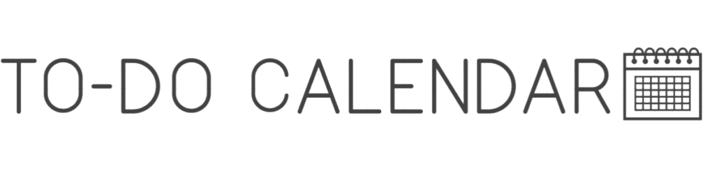

 
  <h2 style="border-bottom: 1px solid #d8dee4; color: #282d33;"> 💻 프로젝트 소개 </h2>  
  
  
- 개인 일정 관리 캘린더 웹 애플리케이션
 
  
- 카카오 & 구글 로그인 지원

  
- 모바일 최적화

  
- Next.js

  <h2 style="border-bottom: 1px solid #d8dee4; color: #282d33;"> 🔍 화면 & 기능 </h2>   
  <table>
    <tr>
      <td align="center" width="33%">
         
        <b>메인 화면</b>
      </td>
      <td align="center" width="33%">
         
        <b>메인 화면</b>
      </td>
      <td align="center" width="33%">
         
        <b>메인 화면</b>
      </td>
    </tr>
  </table>

  <h2 style="border-bottom: 1px solid #d8dee4; color: #282d33;"> 🛠️ 기술 스택 </h2>   
  
 
    

      
      v5
    

    

      
      v18
    

    

      
      v14.2.13
    

    

      
      NextAuth.js(v4.24.8)를 통한 카카오 & 구글 로그인
    

    

      
      카카오 지도(v1.1.27) & 주소 검색
    

    

      
      
      해외 지도 & 주소 검색
    

    

      
      CSS 프레임워크 v3.4.1 (https://tailwindcss.com/)
    

    

      
      React 컴포넌트 라이브러리 (https://mui.com/)
    

    

      
      웹 아이콘 폰트 라이브러리 v6.6.0 (https://fontawesome.com/)
    

    

      
      데이터 가져오기를 위한 React Hooks v2.2.5 (https://swr.vercel.app/ko)
    

    

      
      컴포넌트 애니메이션 v11.5.5 (https://www.framer.com/motion/)
    

    

      
      JavaScript Calendar v6.1.15 (https://fullcalendar.io/)
    

    

      
      상태 관리 v5.0.0-rc.2 (https://zustand-demo.pmnd.rs/)
    

    

      
      모의 데이터 흐름을 위한 가상 서버 API (https://mockapi.io/)
    

    

      
      토스트 메시지 라이브러리 v2.4.1 (https://react-hot-toast.com/)
    

  

